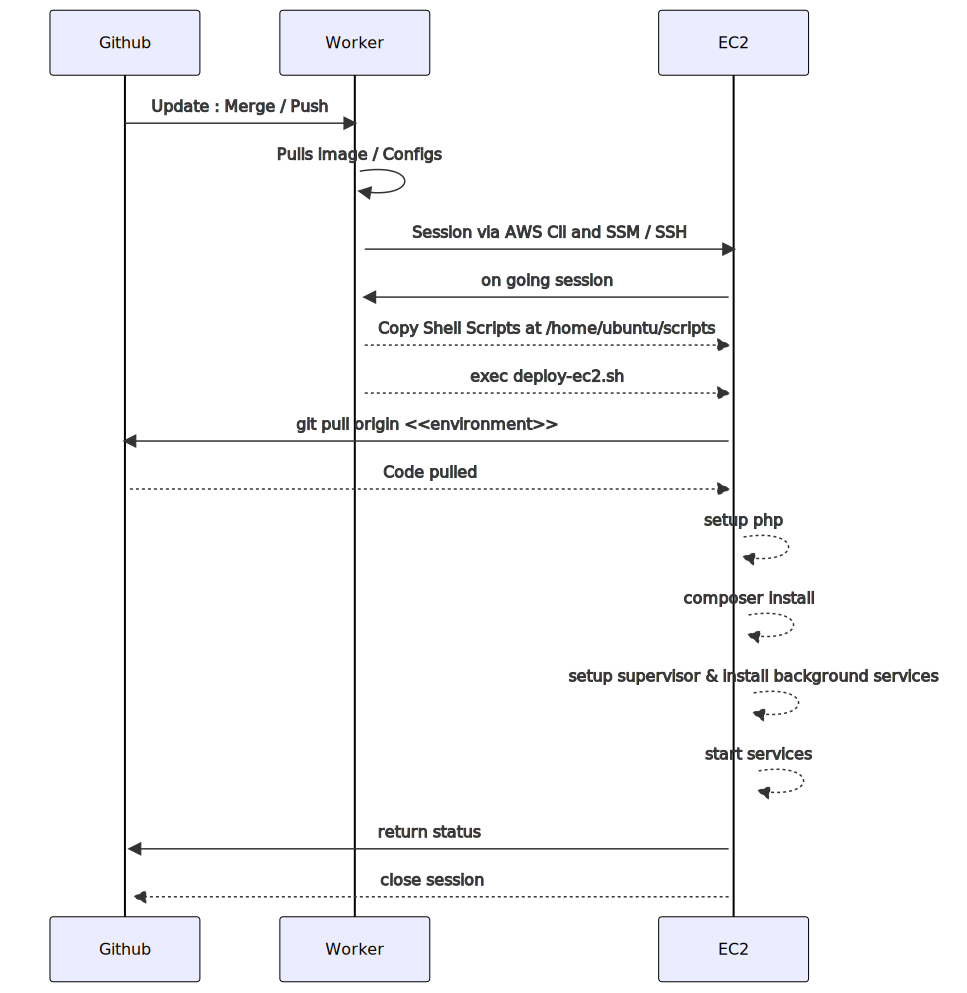

## Infrastructure overview
The ticking application is divided into smaller services. Main application is deployed in beanstalk as shown in diagram :

### Components
Main components of the application are listed below with their usage :

 - [x] **Application Load Balancer** - Stays in front to terminate SSL and forward requests to beanstalk
 - [x] **Cloudfront** - Used to serve static assets from beanstalk
 - [x] **Beanstalk** - Used to host main application code that is served to users
 - [x] **RDS** - Database system to persist user Data
 - [ ] **S3 Bucket** - Stores /public folder synced from cronjob & deployment code depending on environment
	 - [x] Public Folder backup - run by cronjob in each VM hosted by beanstalk
	 - [ ] Serving Static Assets directly to cloudfront instead of hosted application
 - [x]  **SQS Queue** - as message broker to queue emails from beanstalk servers, consumed by Email Server
 - [x] **Email Server** - Copy of main application running consumer workers consuming messages from Dev / Production environment
 - [x] **SES / SMTP Relay Provider** - Email server sends processed emails to email server in limited rate i.e. 7 emails per second to rate limit usage.

    Ticked components are configured and working Unchecked components are to be implemented / configured

## Workflow :
Application is hosted in beanstalk and relevant gitlab pipeline would be triggered at each merge / commit action which will deploy application to relevant server and environment configured.

**Pipeline overview :**

**Beanstalk Deployment Pipeline :**
The beanstalk pipeline is triggered when code is changed in relevant branch. The pipeline is triggered as per environment and worker uses awscli to deploy application copy to S3 and then issue deployment command to beanstalk environment.

The beanstalk hooks are present in deployment hook which takes care of setting up cronjobs inside application VM.

**EC2 Deployment Pipeline :**
The EC2 pipeline is triggered when code is changed in relevant branch. The pipeline is triggered as per environment and worker uses awscli / ssh access to deploy application  then issue deployment command.

The EC2 is configured as per shell scripts present in scripts directory

** Setting up email Server **
Follow its [Documentation](./ec2-setup.md)